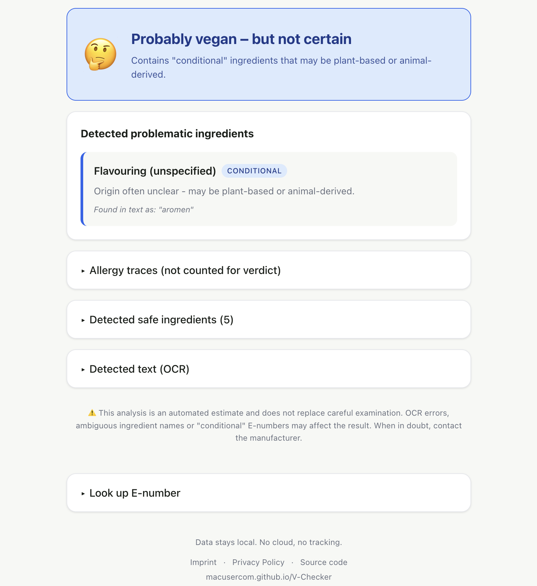

# V-Checker
A privacy-first web app that scans product ingredient lists and tells you if they're vegan or vegetarian. All processing happens locally in the browser — no cloud, no tracking.

🌐 **[Try it live → macusercom.github.io/V-Checker](https://macusercom.github.io/V-Checker/)**


## Features
- Take a photo or upload an image of any ingredient list
- OCR powered by Tesseract.js (German, English, French, Italian, Spanish)
- Checks against a database of 200+ E-numbers and 60+ ingredient keywords
- Classifies as: Vegan / Vegetarian / Not vegetarian / Conditional
- DE/EN interface language switch (independent of OCR language)
- Allergy trace detection — "May contain" sections are flagged as info, not counted for the verdict
- Standalone E-number lookup with bilingual names
- Image preprocessing with adjustable threshold for better OCR results
- No data ever leaves your device


## How To Use
1. Open **[macusercom.github.io/V-Checker](https://macusercom.github.io/V-Checker/)** in your browser
2. Tap **Take photo** or **Choose from gallery** and select an image of the ingredient list
3. Select the language of the text on the packaging (OCR Language)
4. Adjust the threshold slider if needed to improve contrast, then tap **Analyse →**
5. Read the verdict and review any flagged ingredients

No install required. Works on mobile and desktop.


## Run Locally

Tesseract.js requires a local server — opening `index.html` directly as `file://` will not work.

```
git clone https://github.com/Macusercom/V-Checker.git
cd V-Checker
python3 -m http.server
```

Then open [http://localhost:8000](http://localhost:8000) in your browser.


## Images



